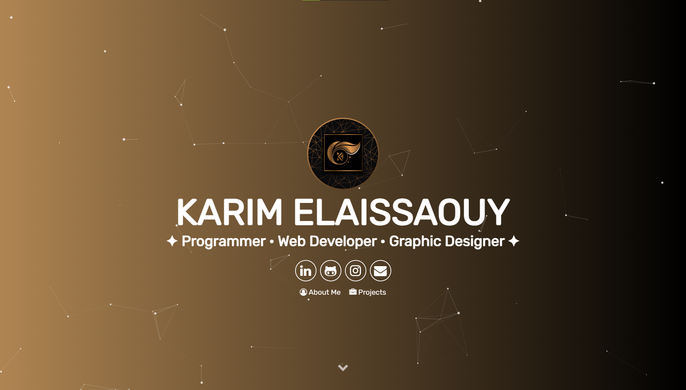

# ALX _ PORTFOLIO

  

 
 I developed this website with the primary intention of establishing an  portfolio that effectively showcases my web presence, resume, personal narrative, and highlighted projects. Leveraging the dynamic capabilities of JavaScript, I integrated engaging visual effects through tools such as Particle.js. The website is powered by Jekyll for seamless content management, while Sass enhances the styling, and Gulp.js streamlines the build process.

It's important to note that this portfolio project was a significant component of my Projects at Alx

# ALX _ PORTFOLIO 2023 PROJECT 

alx portfolio

## Screenshots

## Authors

- [@octokatherine](https://www.github.com/karimelaissaouy)

## Color Reference

| Color             | Hex                                                                |
| ----------------- | ------------------------------------------------------------------ |
| Example Color |  #231f20 |
| Example Color |  #af8552 |

<h3 align="center">I'm ABDELKARIM ELAISSAOUY (KARIM)</h3>

<h3 align="left">Connect with me:</h3>

<h3 align="left">Technologies Used</h3>

      

# Alx_Landing_Page

> alx
---

## Live demo:computer:

---
## Live VD:computer:

---
## Description:bulb:
In this project, I have redesigned the Alx landing page with a fresh, streamlined, and imaginative approach 

---

# Responsive-Landing-Page
This responsive Alx landing page is meticulously crafted to seamlessly adjust to diverse screen sizes and devices. It ensures a user-friendly and visually captivating experience for all visitors, regardless of the device they are accessing it from.

---

